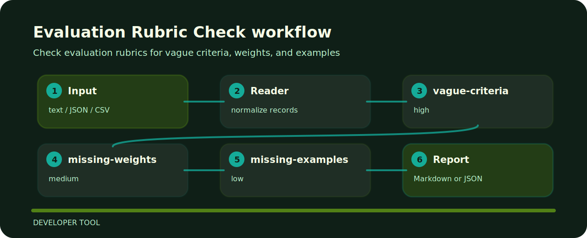

# Evaluation Rubric Check


Check evaluation rubrics for vague criteria, weights, and examples. The command is intentionally direct so it can sit in a local review, a CI step, or a one-off audit.

## Repo landmarks

```text
.github/        CI workflow
examples/       sample inputs
src/            package source
tests/          test coverage
```

## Checks in plain language

| Signal | Level | What it flags | Fix direction |
| --- | --- | --- | --- |
| `vague-criteria` | high | criteria are vague | make rubric criteria measurable |
| `missing-weights` | medium | weights missing | assign scoring weights |
| `missing-examples` | low | examples missing | add scoring examples |

## Finding map



## Fresh clone path

```bash
git clone https://github.com/mertefekurt/evaluation-rubric-check.git
cd evaluation-rubric-check
python -m pip install -e ".[dev]"
evaluation-rubric-check examples/sample.txt
```
